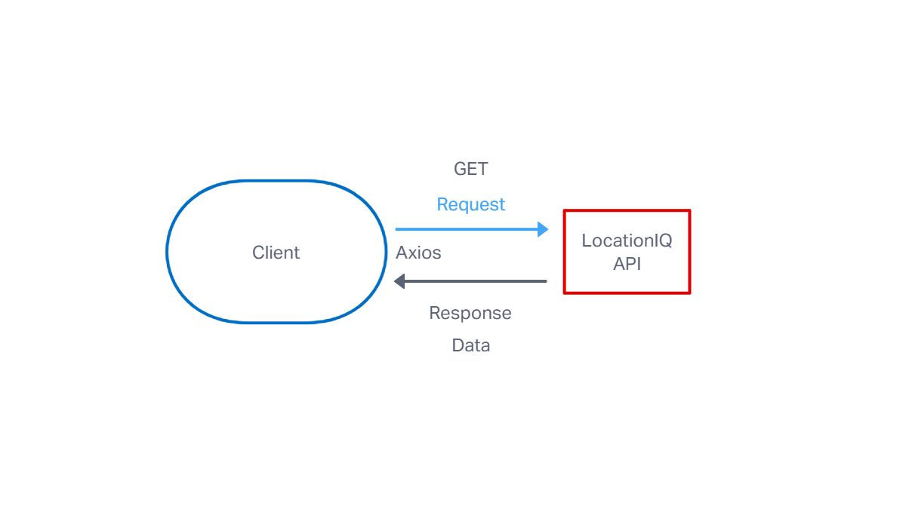
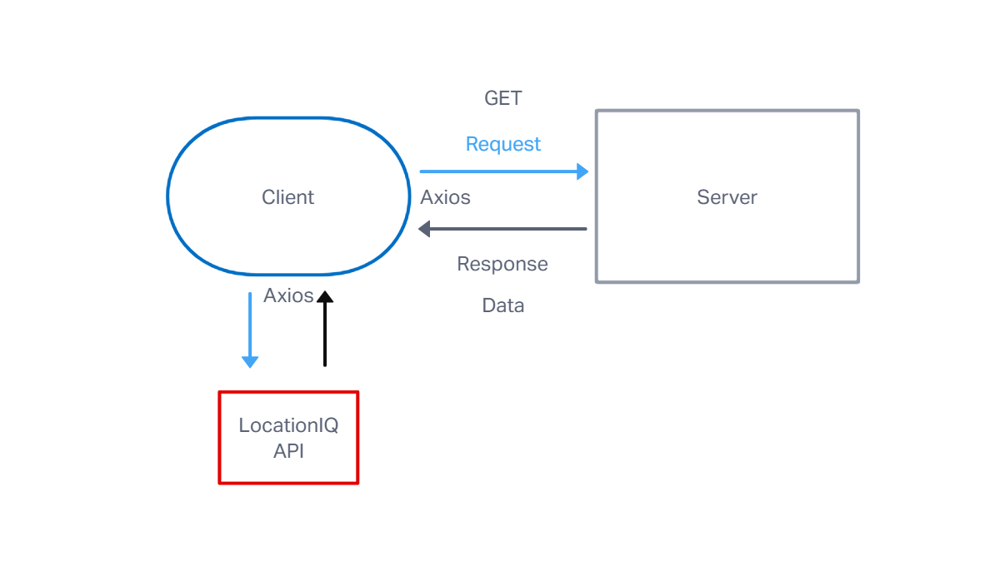

# Project Name

**Author**: Cianenry Danan
**Version**: 1.0.3

## Overview

Let's the user input a city name in the search bar then displays coordinates, a map, weather conditions and a list of movies with the search city name. Error codes are displayed for the corresponding error.

## Getting Started

1. Create a new local repo with the "create-react-app" command.
2. Install axios with the "npm i axios" command.
3. Install boot strap with "npm i bootstrap react-bootstrap" command.
4. Link LocationsIQ API using by creating an env. and adding key.
5. Create a form to query LocationIQ for coordinates.
6. Create code to display location name, coordinates and map image after location search.
7. Create code to display error messages for when an error occurs.

## Architecture
<!-- Provide a detailed description of the application design. What technologies (languages, libraries, etc) you're using, and any other relevant design information. -->
* JavaScript
* CSS
* React.js
* Bootstrap
* Axios JS Library
* LocationIQ Server/API
* Node.js

## Change Log

09-026-2022 6:53pm - Application now displays location name and image after location search and displays an error message when an error occurs.

09-026-2022 10:21am - Application now displays weather conditions for location.

9-29-2022 8:44pm - Application displays live weather conditions and movie data.

## Credit and Collaborations

Collaborated with Mehtab Riar, Megan Hughes, Mahad Ali, Chris Hollis, Ben Lieberman for the web cycle flow diagram.
Credit to Justin  for teaching me how to restart a server.

### Name of feature: Display a map with coordinates

Estimate of time needed to complete: 4 hours

Start time: 2:11

Finish time: 6:53

Actual time needed to complete: 4 hours 40 minutes

### Name of feature: Display weather data

Estimate of time needed to complete: 4 hours

Start time: 3:30 PM

Stop time: 10:00 PM

time: 6.5 hours

Start time: 7:00 AM

Finish time: 10:28 AM

Actual time needed to complete: 10 hours.

### Name of feature: Populate weather forecast with accurate information

Estimate of time needed to complete: 4 hours

Start time: 2:15 pm

Finish time: 10:00 pm

Actual time needed to complete: 8 hours 15 minutes.

### Name of feature: Add movie info after a city search

Estimate of time needed to complete: 4 hours

Start time: 1:10 pm

Finish time: 8:30 pm

Actual time needed to complete: 7 hours 20 minutes.

### Name of feature: Break into components

Estimate of time needed to complete: 2 hours

Start time: 1:00 AM

Finish time: 1:26 AM

Actual time needed to complete: 20 minutes.

### Name of feature: Create a cache to store data

Estimate of time needed to complete: 1 hour

Start time: 10:31 PM

Finish time: 11:10 PM

Actual time needed to complete: 49

